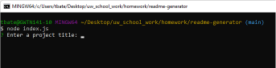

# Readme generator

# Description

The purpose of this project was to generate a professional readme file using command line prompts in node. The program uses javascript and the node inquirer package. 

# Installation

To use this readme generator you must install node and the inquirer package, and clone the code from the index.js file in this repository into your own directory. 

Install Node: [Node.js](https://nodejs.org/en/download/). 

Install Inquirer package: [Inquirer](https://www.npmjs.com/package/inquirer).

# Appearance

# Usage

Use this program to generate readme files for your projects. The readme outline includes an index and several license options to choose from including: Apache, GNU, ISC, MIT, Mozilla, Open, and None. The program asks for the following information:
 - Title
 - Description
 - Installation
 - Usage
 - image file name
 - Credits
 - License
 - Features
 - Contribute
 - Tests
 - github username
 - contact email

## Link to video demonstration

Video demo: [GDrive Link](https://drive.google.com/file/d/1C3jDh-QRo2eVhK2Ri-eIFQU3_5WaCluY/view?usp=sharing) 

## Credits

Credits to Node.js, and mainainers of the Inquirer package and related packages. Also to [shields.io](https://shields.io/) for hosting the license badge URLs.
